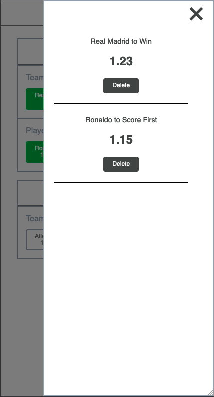

This is a project to train React + Typescript + styled-components by doing the [Addison Global Frontend Technical Assessment](https://github.com/addisonglobal/frontend-technical-test) which was found in the repository of [Front-end Challenges](https://github.com/felipefialho/frontend-challenges).

Redux was not used in this challenge in order to train object composition in such way to avoid excessive [Prop Drilling](https://kentcdodds.com/blog/prop-drilling).

In the project directory, you can run:

### `yarn server`

### `yarn start`

